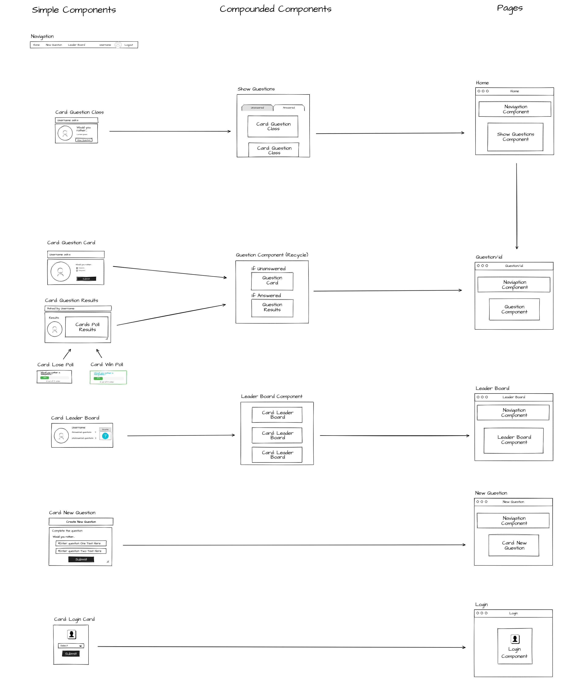
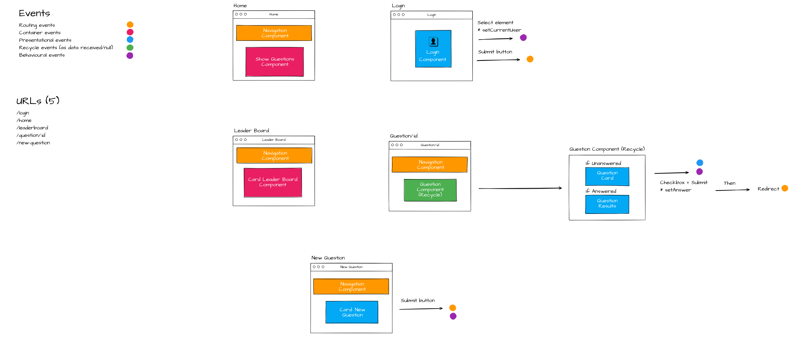
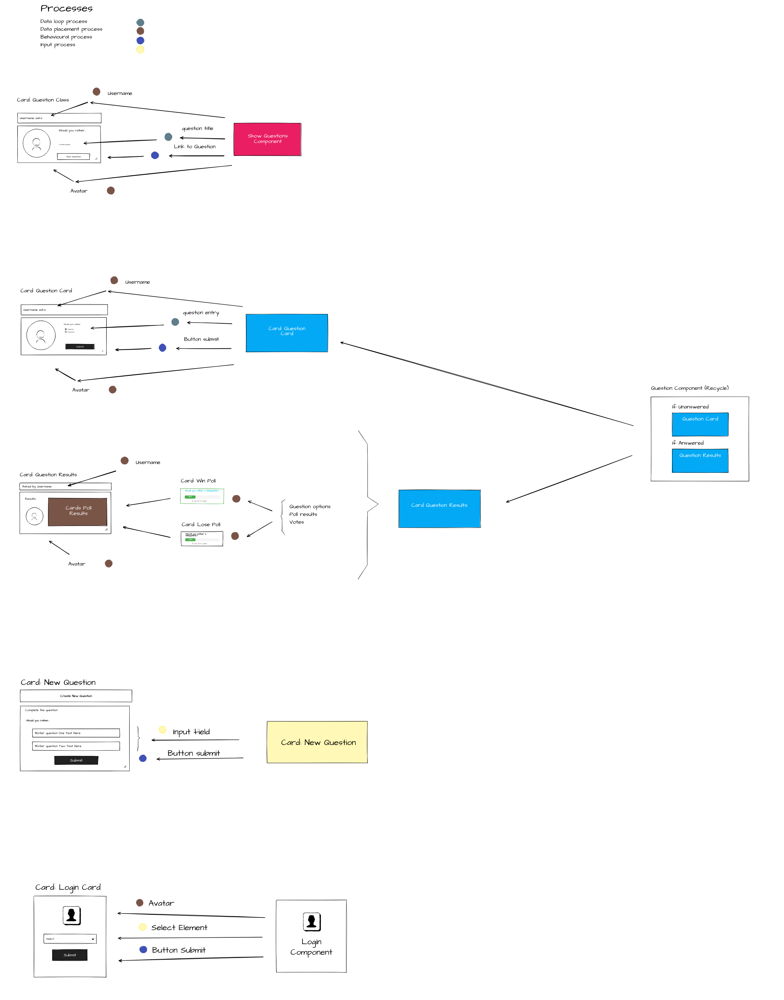

# Template for Building React/ Redux Projects

Planning out your app is imperative to success.

Sample Project [Video][4]

## Planning Stage

* Step 1 - Draw All of the Views of the App
* Step 2 - Break Each View Into a Hierarchy of Components
* Step 3 - Determine What Events Happen in the App
* Step 4 - Determine What Data Lives in the Store

## Coding Stage

* Step 1 - Design the [shape of the state][1] and [create reducers][2].
* Step 2 - Create a Redux store. Connect logger middleware (optional) and Redux Thunk middleware.
* Step 3 - For each view that needs access to the store, create the component and connect it to the store.
* Step 4 - For the component you created in the last step, create actions and action creators. Check that everything works correctly.
* Step 5 - Repeat Step 3 & Step 4 for each component that needs access to the store.
* Step 6 - Create presentational components and confirm that everything works correctly.
* Step 7 - Add React Router.
* Step 8 - Add finishing touches and make sure the project meets the [rubric][3].

## Action Plan

* Phase A: download data (Container events)
    * Step 1 - Connect Store
    * Step 2 - Loading data into the Store
    * Step 3 - Download & render data

* Phase B: upload data (Presentational events)
    * Step 1 - Event handlers=> console.log
    * Step 2 - Replace console.log by dispatch (actions)

### Hierarchy of Components

### Events Happen

### Data Lives

[1]: https://redux.js.org/usage/structuring-reducers/normalizing-state-shape
[2]: https://redux.js.org/tutorials/fundamentals/part-3-state-actions-reducers
[3]: https://review.udacity.com/#!/rubrics/1567/view
[4]: https://learn.udacity.com/nanodegrees/nd019/parts/87b7741f-aace-4bc9-88f4-7feccbb6eacb/lessons/996c5cf6-3220-42f5-a780-3ab2752f2fb2/concepts/d0b35860-eabe-414e-80bb-bfc0edeab6fe